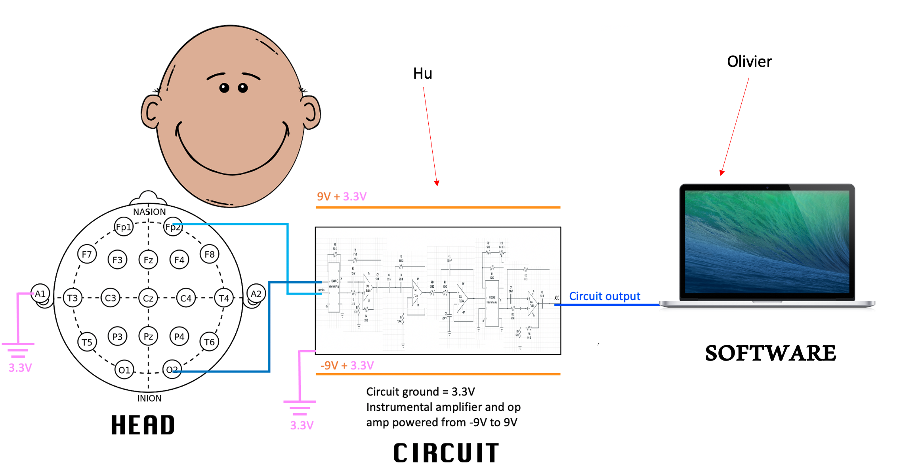
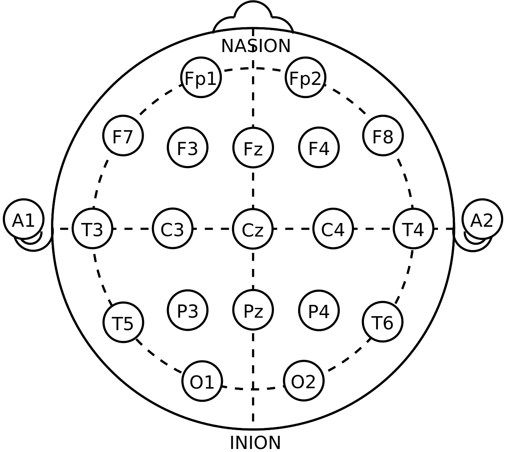

# EEG
For our PWS (School Research Project) at Christelijk Gymnasium Utrecht, we have built an EEG (electroencephalogram) machine. This is a machine that measures brain waves, voltage differences which oscillate and represent synchronized activity over a network of neurons. For our project, we measure alpha waves originating from the occipital lobe because they are one of the strongest EEG signals. Alpha waves reflect activities in the visual cortex; when someone closes their eyes or relaxes, their magnitude is increased, and decreased with open eyes and concentration.

## We have used the EEG data for multiple applications:
- [Analyzing the data.](analysis)
- [Playing flappy bird by blinking.](flappy)
- [Predicting whether people have their eyes open or closed (our data and data from others as they measured multiple channels).](prediction)

## Wiring

This diagram describes the EEG machine. Three electrodes are taped to the subject's scalp at O2, Fp2, and A1 according to the [10-20 system](https://en.wikipedia.org/wiki/10%E2%80%9320_system_(EEG)). These electrodes are then attached to the circuit, which amplifies the signal filters out everything except for the alpha waves. The signal then goes through an audio interface and then into the computer, which will treat it like a microphone.

This is how the circuit looks in reality:

## Electrode placement for alpha waves
We used one-time use ECG (electrocardiogram) electrodes, which can be used for an EEG as well.  
To measure alpha waves, "we need to use three electrodes: one at the left mastoid (the bone at the back of the left ear) which is connected to the ground of the circuit. This electrode helps with noise cancelling; one located one inch above and one inch to the right of the nasion (the midline bony depression between the eyes where the frontal and two nasal bones meet); the last one located one inch above and one inch right of the inion (the projecting part of the occipital bone at the base of the skull). The 2nd and 3rd electrode placements are approximately in O2 and Fp2 regions in the below diagram:

The voltage difference oscillations between the 2nd and 3rd electrodes are the target alpha waves, which are then fed to the circuit to be amplified and filtered." (Lopez, 2021/2023)  
We think that the alpha waves are the oscillations between the 2nd and 3rd electrode because of the [Einthoven triangle](https://en.wikipedia.org/wiki/Einthoven%27s_triangle), that our EEG works just like an ECG.

## Circuit
For the explanation of the circuit, see the [hardware file](hardware.md).

## Software
For the explanation of the signal processing and the application, see the [software file](software.md).

## Discussion
If you want to continue with our project to improve it, see the [discussion file](discussion.md).

## Bibliography
Our most important source was [Ryan Lopez' EEG project](https://github.com/ryanlopezzzz/EEG). For the other sources, see the [bibliography file](bibliography.txt).