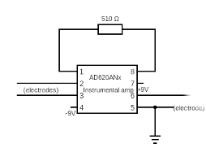

# Hardware
For every term that we did not understand, we have added a link to an explanation as a hyperlink.

## Materials
See the [materials file](materials.md).

## Circuit
The circuit has two main purposes, which are amplifying and filtering. The signal coming from the brain is 15 μV to 50 μV, which is too small to measure. An AD620 is used for the amplifying. There will also be a lot of noise coming from the alternating current, which is used in almost any electrical tool. In Europe the AC is 50 Hz and in America it is 60 Hz. This circuit is also focusing on the alpha waves. Thus, only 8-12 Hz are needed.

The term [ground](https://www.build-electronic-circuits.com/what-is-ground/) is always used when building any electrical circuit. In this circuit a [dual rail power supply](https://www.youtube.com/watch?v=jiWKQEOSgIs) is needed to power the operational amplifiers. Just remember that every ground needs to be connected to each other. Look at the pictures below to see how the batteries are wired on a breadboard and schematic. In the schematic the positive voltage terminal is connected to pin 7 and the negative terminal is connected to pin 4 of the AD620. There is also a LED used for remembering, whether the circuit is turned on or off. 

With the battery supply done only the main circuit needs to be build. Read everything on this page first and after that start building. The following image shows the entire circuit consisting of:
- Two AD620 instrumental amplifiers
- Two notch filters
- Low pass filter
- High pass filter 

### First amplifier (gain ≈ 100)
The miniscule signal that comes from the brain will firstly go through the [instrumental amplifier](https://www.youtube.com/watch?v=NvyDw8ZpLd0). The resistance value between pin 1 and 8 determines the gain. Refer to the [datasheet of the AD620](https://www.analog.com/media/en/technical-documentation/data-sheets/ad620.pdf) for the gain. I used a 510 Ω resistor for a gain of around 100 times the original voltage.  
Connect electrode O2 to pin 2, Fp2 to pin 3 and A1 to pin 5. Pin 5 also needs to be connected to the ground. Lastly, pin 6 is the output of the signal, that will go to the notch filter.

### First notch filter (50 Hz)
In this circuit a [twin-T notch filter](https://www.electronics-tutorials.ws/filter/band-stop-filter.html) configuration is used. This filter is great at filtering the 50 Hz noise. The values of the [resistors](https://www.youtube.com/watch?v=G3H5lKoWPpY) and [capacitors](https://www.youtube.com/watch?v=f_MZNsEqyQw) can be different than what I used. There are lots of online notch filter calculators, [this one](https://www.changpuak.ch/electronics/Active_Notch_Filter.php), [this one](https://www.falstad.com/circuit/e-twint.html), and [this one](http://www.learningaboutelectronics.com/Articles/Notch-filter-calculator.php#answer1). Try to avoid using many resistors in series or capacitors in parallel as it will produce worse results. Try to get as close as possible to 50 Hz using the formula f=1/4πRC. The notch filter is consists of two parts a high pass filter and a low pass filter. The values of the high pass filter are calculated using the formula and the values of the low pass filter are double the values of the high pass filter. 

### High pass filter (cutoff frequency ≈ 7.2 Hz)
A [passive high pass filter](https://www.electronics-tutorials.ws/filter/filter_3.html) will let current with frequencies higher than the cutoff frequency through. Every filter is a voltage divider, however instead of two resistors one resistor is replaced by a capacitor. The filter uses the [capacitive reactance](https://www.electronics-tutorials.ws/filter/filter_1.html) of a capacitor to do that. The first picture is the voltage divider and the second are third are the same high pass filter, but written differently. 

There is also a phenomenon called [attenuation](https://www.analogictips.com/what-is-signal-attenuation/), which causes the output voltage to be lower than the input voltage. This problem can be solved using an [active high pass filter](https://www.electronics-tutorials.ws/filter/filter_6.html). The active filter uses a [unity gain buffer](https://www.youtube.com/watch?v=_o4ScgRZtNI&list=PLYOzRtEd5NhPRT5-c5eZEeUGodW_Rb_c6&index=7). In this circuit an op-amp  ([TL084CN](https://www.ti.com/lit/ds/symlink/tl082a.pdf?ts=1699103154231&ref_url=https%253A%252F%252Fwww.ti.com%252Fproduct%252FTL082A%252Fpart-details%252FTL082ACP)) is utilized . I used the [Sallen key topology](https://www.electronics-tutorials.ws/filter/sallen-key-filter.html), because it was the most efficient.

### Low pass filter (cut-off frequency ≈ 32.9 Hz)
The [passive low pass filter](https://www.electronics-tutorials.ws/filter/filter_2.html) is almost the same as the passive high pass filter. The only difference being that the capacitor is switched. The cut-off frequency is a lot higher than the 8-12 Hz, because we did not want to let the slope of the filter affect our signal. As stated above an [active low pass filter](https://www.electronics-tutorials.ws/filter/filter_5.html) with the Sallen key topology is utilized. 

### Second instrumental amplifier (gain = 10)
This is the last amplifier in the circuit. It has a gain of 10, so the original brain signal will be amplified 100 x 10 = 1000 times. The output voltage is than high enough to be picked up by mic in port in the external USB soundcard. Before the signal is translated by the [analog to digital converter in the soundcard](https://en.wikipedia.org/wiki/Analog-to-digital_converter), it has to be filtered one last time. 

### Second Notch filter (cut-off frequency = 50 Hz)
Exactly the same as the notch filter above. To get a better output signal use different resistor and capacitor values.

### Into the computer
Connect the output signal to the tip of the audio cable and connect the sleeve to the ground in the circuit using alligator clips. Put the other side of the audio cable in the external USB soundcard and connect that to the laptop. Open up Audacity and make sure that the input is the mic in audio input from the soundcard. It is possible to play with the input sensitivity, but I would set that to 100 procent. That is the last step. 

