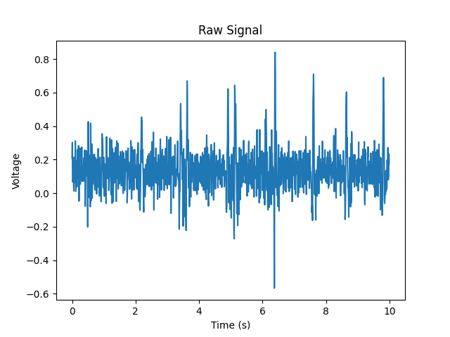

# Software

## Recording the data
We record the data by treating the EEG as a microphone and then saving it to a .wav file. See our [record_data.py file](../analysis/record_data.py).

## Processing the data
Now that we have the raw signal:

A great explanation of signal processing in Python is the [Realpython guide](https://realpython.com/python-scipy-fft/).

To extract the alpha waves (8-12Hz) from the raw data, which still contains some noise, we first need to calculate a power spectrogram of the data using a Fourier transform. For a good explanation of a Fourier transformation, see [3blue1brown's video](https://www.youtube.com/watch?v=spUNpyF58BY). This is what the 'get_power_spectrum' function in [analyze_functions.py](../analysis/analyze_functions.py) does:

You can observe clear peaks at 8-12 Hz, but there is still some noise (especially at 50 Hz as Europe's electricity network operates at 50 Hz). We can filter this by setting all frequency components outside of 8-12 Hz to 0, and then take the inverse Fourier transform to reconstruct the signal. See the 'get_brain_wave function' in [analyze_functions.py file](../analysis/analyze_functions.py):

For this data, Hu had his eyes open and blinked a few times. The peaks correspond to the moments when Hu blinked.

## Flappy bird
Flappy Bird is coded in Python using pygame. Instead of being able to jump by pressing the space button, you can jump by blinking. See the 'detect_jump' function in the [sprites.py file](../flappy/sprites.py). To make the game harder/easier, you can alter the difficulty of the game by changing the time between pipes, the speed of the pipes, and the space between the bottom and upper pipe in the [constants.py file](../flappy/constants.py).

For the live demonstration, see the [EEG flappy bird video](https://www.youtube.com/watch?v=r0rO_v2g-HE).

## Predicting whether someones eyes are open or closed (external dataset)
We built three different models to predict whether someone's eyes are open or closed: a K Nearest Neighbors model, a Support Vector Machine, and a neural network built using Keras and Tensorflow. For a great explanation of all the concepts, I highly recommend checking out [Sentdex's machine learning YouTube course](https://www.youtube.com/watch?v=OGxgnH8y2NM&list=PLQVvvaa0QuDfKTOs3Keq_kaG2P55YRn5v). To train the Support Vector Machine, I recommend following ['A Practical Guide to Support Vector Classification'](https://www.csie.ntu.edu.tw/~cjlin/papers/guide/guide.pdf). The neural network performed the worst, achieving only an accuracy of 56%. We used the following dataset: [Eye State Classification EEG Dataset](https://www.kaggle.com/datasets/robikscube/eye-state-classification-eeg-dataset).

## Predicting whether someones eyes are open or closed (our data)
Predicting whether we had our eyes open or closed was not very difficult. For this, we need to calculate the Root Mean Squared (RMS) voltage. To understand what the RMS-voltage is and how to calculate it from the Fourier series, I quite liked the first 12 videos from this video series: [Introduction to Power Electronics (2023) - YouTube](https://www.youtube.com/playlist?list=PLmK1EnKxphinxBub5hL0ZoJXWoqjkGE19). I used the code in [Ryan Lopez' EEG project](https://github.com/ryanlopezzzz/EEG) for this.

If you can predict whether someone has their eyes open or closed, you can easily create a binary keyboard with which you can slowly zoom in on specific letters (e.g. the left half corresponds to open eyes and the right half to closed eyes). If someone has lost their capacity to communicate, this can be a great way to allow them to easily type a message with their brain. Or: one could write morse code with their brain.