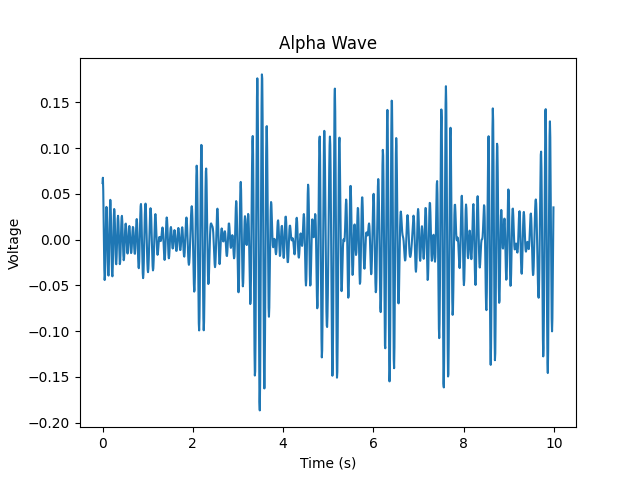

# Software

## Recording the data
We record the data by recording the headphone jack and then writing it to a .wav file. See our [record_data.py file](analysis/record_data.py).

## Processing the data
Now that we have the raw signal:

A great explanation on signal processing in python is the [Realpython guide](https://realpython.com/python-scipy-fft/).

To get the alpha waves (8-12hz) from the raw data as it still contains some noise, we firstly have to calculate the a power spectogram of the data using a fourier transform. For a good explanation on a Fourier transformation see [3blue1brown's video](https://www.youtube.com/watch?v=spUNpyF58BY).This is what the get_power_spectrum function in [analyze_functions.py](analysis/analyze_functions.py) does:

You can see that there are clear peaks at 8-12 hz, but that there still is some noise (especially at 50 hz as Europe's electricity net works at 50 hz). We can filter this by setting all frequency components outside of 8-12 hz to 0, and then take the inverse fourier transform to reconstruct the signal. See the get_brain_wave function in [analyze_functions.py file](analysis/analyze_functions.py):

For this data, Hu had his eyes open and blinked a few times. The peaks correspond to the moment when Hu blinked.

## Flappy bird
Flappy bird is coded in python using pygame. Instead of being able to jump by pressing the space button, you can jump by blinking. See the detect_jump function in the [sprites.py file](flappy/sprites.py). Too make the game harder/easier you can alter the difficulty of the game by changing the time between pipes, the speed of the pipes and the space between the bottom and upper pipe in the [constants.py file](flappy/constants.py).

For the live demonstration, see the [EEG flappy bird video](videos/EEG%20flappy%20video.mp4).

## Predicting whether someones eyes are open or closed
We built three different models to predict whether someones eyes are open or closed: a K Nearest Neightbors model, s Support Vector Machine, and a neural network build using Keras and Tensorflow. For a great explanation for all the concepts I highly recommend checking out [Sentdex' machine learning youtube course](https://www.youtube.com/watch?v=OGxgnH8y2NM&list=PLQVvvaa0QuDfKTOs3Keq_kaG2P55YRn5v). 

